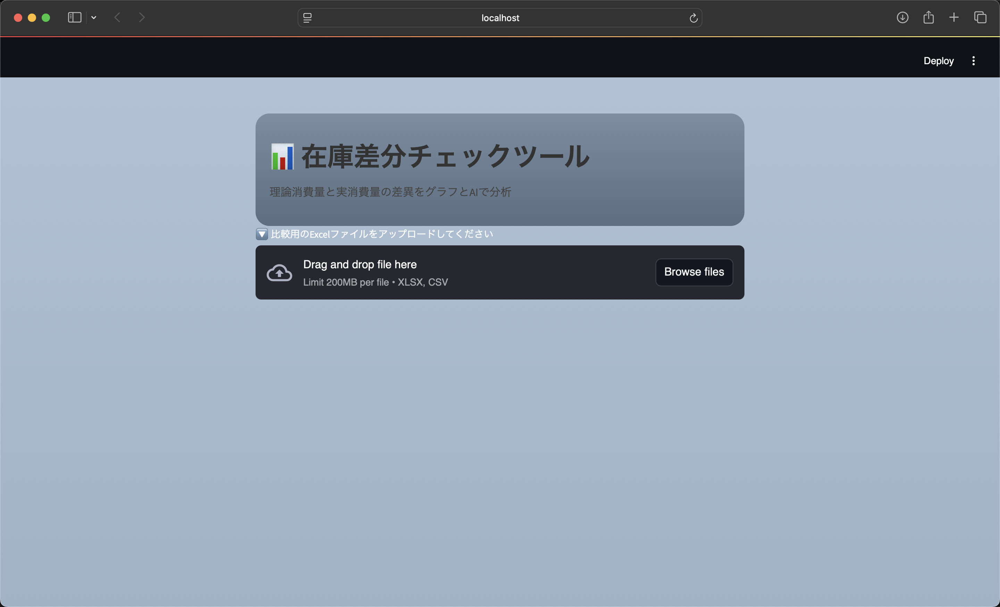
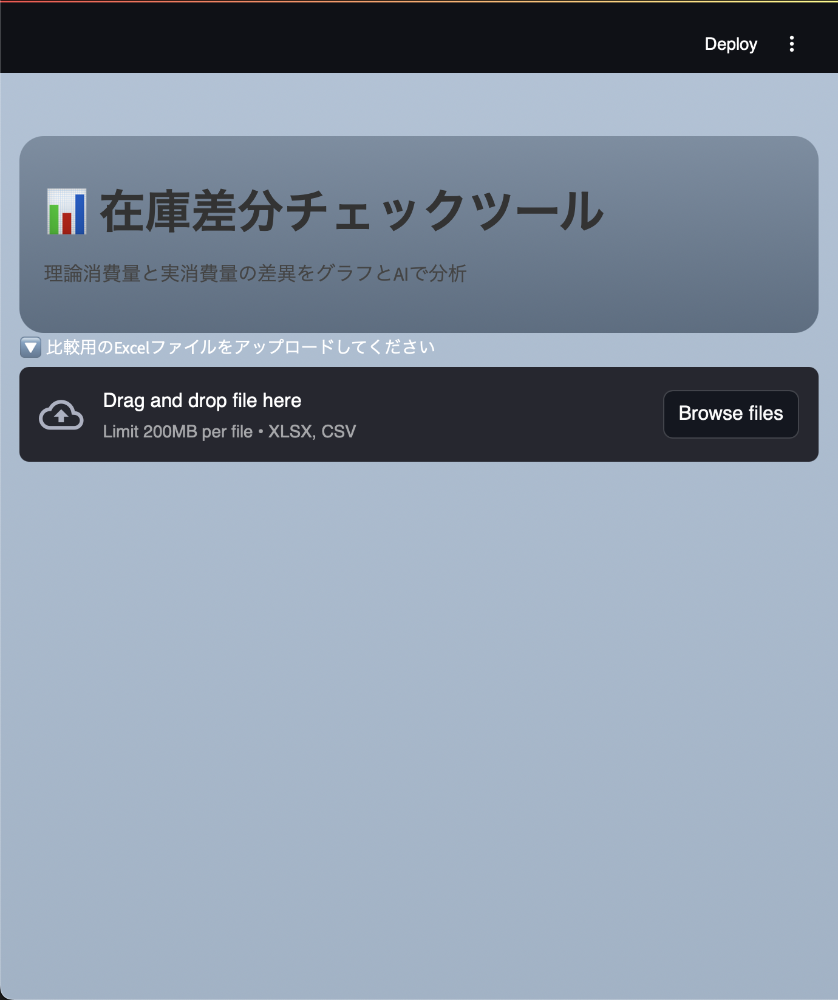
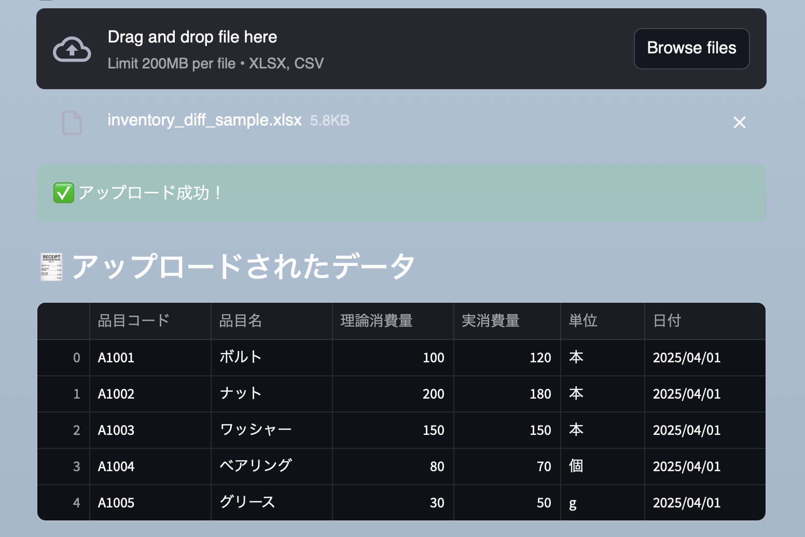
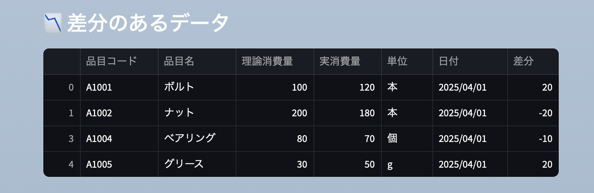
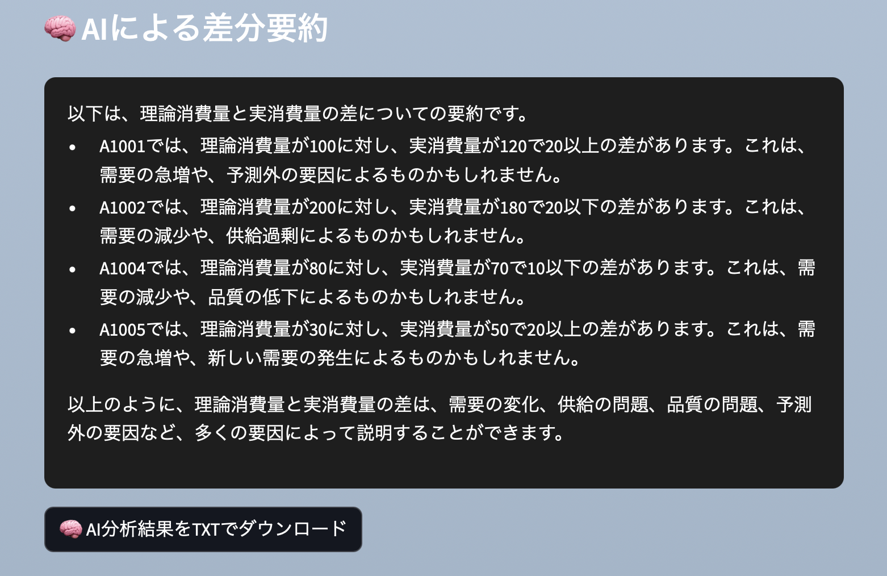

# 📊 在庫差分チェックAIツール

理論消費量と実消費量の差異を自動判定・グラフで可視化し、  
さらにAIによる分析コメントを生成する Streamlit 製の Web ツールです。

---

## 🚀 主な機能

- 📁 Excelファイルをアップロードして差分チェック
- 📉 差分のあるデータを抽出＆表示
- 📊 理論消費量と実消費量の比較グラフを自動生成
- 🧠 GroqのAIモデル（llama3）による日本語分析コメントの生成
- 📥 分析結果のTXT出力、グラフ画像のダウンロード機能あり
- 📱 スマホでも見やすいレスポンシブ対応UI（グラデーション背景）

---

## 🖼 画面イメージ
### 🔽 実行画面PC


### 🔽 実行画面スマホ


### 🔽 ファイルアップロード後


### 🔍 差分抽出


### 📊 グラフ


### 🧠 AIによる分析コメント


---

## 📂 使用技術

| 分類    | 使用技術                                    |
|--------|--------------------------------------------|
| フロント | Streamlit                                 |
| 分析   | pandas / matplotlib                        |
| AI連携 | Groq API（llama3-8b）                       |
| 可視化 | 棒グラフ（matplotlib）                        |
| その他 | WordCloud / グラデ背景 / ダウンロード機能       |

---

## 📦 セットアップ方法

1. Python 3.9〜3.11 をインストール
2. 仮想環境を作成（任意）
3. 必要なライブラリをインストール：

    ```bash
    pip install -r requirements.txt
    ```

4. `.env` ファイルを作成し、以下を記述：

    ```
    GROQ_API_KEY=sk-xxxxxxx  ← GroqのAPIキー
    ```

5. アプリを起動：

    ```bash
    streamlit run streamlit_app.py
    ```

---

## 📝 注意事項

- `.env` ファイルにはAPIキーを含むため、**絶対にGitHubへ公開しないでください**  
- `requirements.txt` に必要なライブラリはすべて記載済みです

---

## 📄 ライセンス

このリポジトリは **MIT License** のもとで公開されています。

---

## 🧑‍💻 作者

- GitHub: `u8m`

---